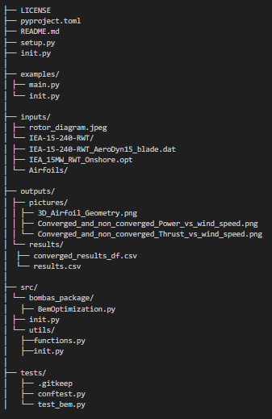
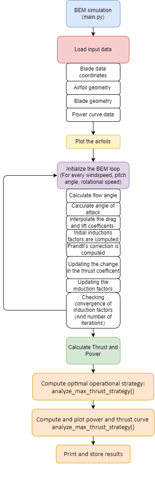

# Our Package

Team: [la_bombas_del_diablo]

## Overview

This project implements a Blade Element Momentum (BEM) theory-based optimization model to predict the aerodynamic performance of a wind turbine — specifically, the IEA-15-240-RWT reference turbine.

It calculates blade thrust, torque, and aerodynamic power at various wind speeds using detailed airfoil data, blade geometry, and operational parameters.

The objective is to iteratively solve for optimal axial and tangential induction factors for each blade element, ensure convergence, and output an optimized power curve that can be compared against reference data.

## Quick-start Guide

### Step 1: Clone the repository

(In git bash)
git clone https://github.com/github-username/final-project-la_bombas_del_diablo.git
cd final-project-la_bombas_del_diablo

### Step 2: Navigate to the root of the cloned repository
You can do this using a terminal like Anaconda Prompt.
Example path on Windows:

cd C:\Users\User_example\folder_example\final-project-la_bombas_del_diablo

### Step 3: Install the package
Run the following command:

pip install .

This will automatically install the required dependencies listed in setup.py, including:

numpy, pandas, matplotlib, scipy

### Step 4: Run the main script

python .\examples\main.py

## Architecture
This section describes the folder structure, the main class `BemOptimization` and its key functions, as well as the overall workflow of the package — visually presented in a flow diagram and complemented by a more technical explanation.

The folder structure of the package 

## Package Structure and Classes

### Main Script

### BemOptimization

This class handles the entire BEM optimization and results extraction process.

#### `__init__(self, index)`
Initializes the optimization for a given wind speed entry.

#### `initialize_elements_df(self, blade_data_df)`
Prepares the DataFrame where all parameters will be stored.  
Loads the relevant blade data — span position, blade twist angle, chord length — into it, and initializes the induction factors to zero.

#### `optimize_induction_factors(self, ...)`
Iteratively solves for optimal axial and tangential induction factors until convergence.

#### `calculate_thrust_and_power(self, elements_df)`
Computes total thrust, torque, and aerodynamic power from the blade element data.

## Test Classes Description

Class folder placement: final-project-la_bombas_del_diablo\tests\test_bem.py

#### TestCorePhysics

Tests basic aerodynamic calculations such as flow angle, angle of attack, lift and drag coefficients, and performance metrics like power and thrust.

#### TestInduction

Tests the update logic for axial and tangential induction factors, including Prandtl’s tip-loss correction and Joe’s iterative method.

#### TestDifferentials

Verifies the calculation of differential thrust, torque, and aerodynamic power based on blade element data.

#### TestConvergenceFlow

Checks the convergence behavior of the iterative optimization loop and validates spanwise flow angle computations.

#### TestFileReaders

Tests that airfoil geometry, polar data, and blade design files are correctly read and handled, including missing or malformed input.

#### TestPlotting

Validates that all plotting functions execute without errors. File saving is suppressed during tests to avoid side effects.

#### TestBemOptimization

Integration test that runs the full BEM optimization workflow, from initialization to induction optimization and final performance calculations.

## Code Description

### Package Architecture Description
The BEM Optimization package is structured to follow a sequential data-processing and computation pipeline, starting from input loading to final result visualization. Each stage in the architecture is implemented as modular code, allowing individual testing and future extension. The overall workflow and package components are outlined below and visualized in the accompanying diagram.

1. **Main Controller – `main.py`**  
   The simulation is initiated through `main.py`, which serves as the entry point. This script orchestrates the overall flow:
   - Loading data  
   - Executing the BEM loop  
   - Managing outputs

2. **Input Handling**  
   A dedicated module is responsible for reading and preprocessing:
   - Blade data coordinates  
   - Airfoil geometry  
   - Blade geometry  
   - Power curve data  

   These inputs are structured and passed to the solver in a format suitable for numerical processing.

3. **Preprocessing and Plotting**  
   Airfoil geometry is plotted prior to simulation. This step acts as a visual verification of:
   - Correct airfoil shape  
   - Input file integrity

4. **BEM Solver Loop Initialization**  
   For each combination of:
   - Wind speed  
   - Pitch angle  
   - Rotational speed  

   the BEM loop is initialized. Within each loop iteration, the following operations are performed:
   - Calculate flow angle  
   - Calculate angle of attack  
   - Interpolate drag and lift coefficients  
   - Compute initial induction factors  
   - Apply Prandtl’s tip-loss correction  
   - Update thrust coefficient  
   - Iteratively update induction factors  
   - Check convergence of induction values  

   This iterative loop forms the core aerodynamic calculation.

5. **Thrust and Power Calculation**  
   Once convergence is achieved, the aerodynamic performance metrics are computed:
   - Thrust  
   - Torque  
   - Aerodynamic power  

   using the final values of flow variables and forces.

6. **Results Output and Plotting**  
   Simulation results are stored and visualized. This includes:
   - Power curves  
   - Thrust profiles  
   - Convergence behavior  

   These plots support validation and interpretation of the simulation results.

A flow diagram of the code can be found in the file `flow_diagram_bem_optimization.png`:

## Methodology and Git Workflow

Before the beginning of the project, the group agreed to follow the workflow described below:

### Pair Programming (Preferred)
- Schedule meetings for pair programming.
- Code together using screensharing.
- One person acts as the "driver" (writes the code), while others instruct and assist.

### Solo Remote Work
When working individually, follow this Git workflow and communication protocol:

1. **Pull** the latest changes from the main branch.
2. **Post in chat**:
   - What you're going to work on.
   - What the current status is since last time.
3. **Create a feature branch** (not a name-branch); use a descriptive name based on what you're working on.
4. **Code and commit regularly**:
   - a. When something works or there's a natural pause, **commit and push**.
   - b. **Commit message** should clearly state what was done.
5. **Create a pull request** for the specific change.
6. **Ask in chat**: "Please pull it."
7. **Post in chat**: Current status and progress.
8. *(Optional)* Start working on a new task, and repeat the workflow from step 1.

├── LICENSE
├── pyproject.toml
├── README.md
├── setup.py
├── init.py
│
├── examples/
│ ├── main.py
│ └── init.py
│
├── inputs/
│ ├── rotor_diagram.jpeg
│ └── IEA-15-240-RWT/
│ ├── IEA-15-240-RWT_AeroDyn15_blade.dat
│ ├── IEA_15MW_RWT_Onshore.opt
│ └── Airfoils/
│
├── outputs/
│ ├── pictures/
│ │ ├── 3D_Airfoil_Geometry.png
│ │ ├── Converged_and_non_converged_Power_vs_wind_speed.png
│ │ └── Converged_and_non_converged_Thrust_vs_wind_speed.png
│ └── results/
│  ├── converged_results_df.csv
│  └── results.csv
│
├── src/
│ └── bombas_package/
│   ├── BemOptimization.py
│ ├── init.py
│ └── utils/
│   ├──functions.py
│   ├──init.py
│
├── tests/
│   ├── .gitkeep
│   ├── conftest.py
│   └── test_bem.py